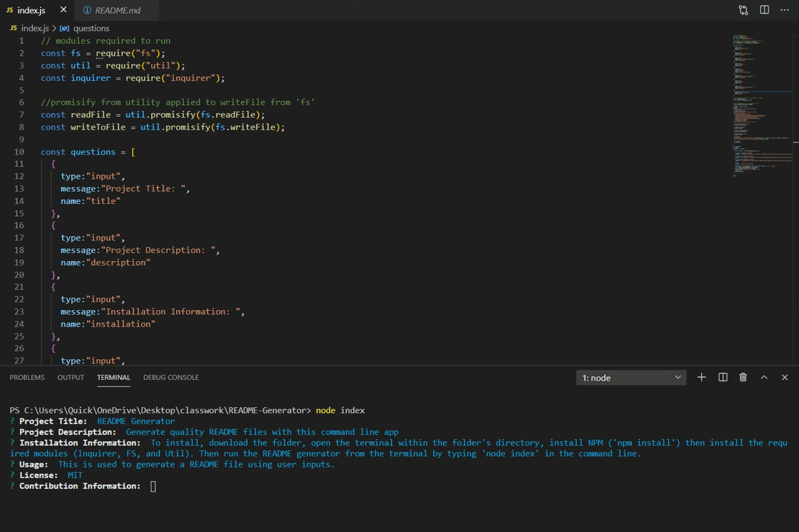

  # Title README Generator
 

  ## Description
  Generate quality README files with this command line app

  # Table of Contents
  - [Description](#Description)
  - [Installation-Instructions](#Installation-Instructions)
  - [Contribution-Guidelines](#Contribution-Guidelines)
  - [Usage-Information](#Usage-Information)
  - [Testing-Instructions](#Testing-Instructions)
  - [Feedback](#Feedback)
  - [License](#License)

 
  
  ## Installation-Instructions
  To install, download the folder, open the terminal within the folder's directory, install NPM ('npm install') then install the required modules (Inquirer, FS, and Util). Then run the README generator from the terminal by typing 'node index' in the command line.

  ## Usage-Information
  This is used to generate a README file using user inputs.

  ## Contribution-Guidelines
  If you would like to contribute to this project feel free to reach out to me at the contact information listed below.

  ## Testing-Instructions
  Try choosing different license types

  ## Feedback 
  For questions or information about this README generator, I can be reached at I can be reached at I can be reached at jbenningfield.dev@gmail.com for any additional questions or information about this README generator. for any additional questions or information about this README generator. Find me on GitHub here: https://www.github.com/ubern00bie 
  Find me on GitHub here: https://www.github.com/Ubern00bie
  
  ## License
  Copyright (c) [year] [fullname]

Permission is hereby granted, free of charge, to any person obtaining a copy
of this software and associated documentation files (the "Software"), to deal
in the Software without restriction, including without limitation the rights
to use, copy, modify, merge, publish, distribute, sublicense, and/or sell
copies of the Software, and to permit persons to whom the Software is
furnished to do so, subject to the following conditions:

The above copyright notice and this permission notice shall be included in all
copies or substantial portions of the Software.

THE SOFTWARE IS PROVIDED "AS IS", WITHOUT WARRANTY OF ANY KIND, EXPRESS OR
IMPLIED, INCLUDING BUT NOT LIMITED TO THE WARRANTIES OF MERCHANTABILITY,
FITNESS FOR A PARTICULAR PURPOSE AND NONINFRINGEMENT. IN NO EVENT SHALL THE
AUTHORS OR COPYRIGHT HOLDERS BE LIABLE FOR ANY CLAIM, DAMAGES OR OTHER
LIABILITY, WHETHER IN AN ACTION OF CONTRACT, TORT OR OTHERWISE, ARISING FROM,
OUT OF OR IN CONNECTION WITH THE SOFTWARE OR THE USE OR OTHER DEALINGS IN THE
SOFTWARE.
